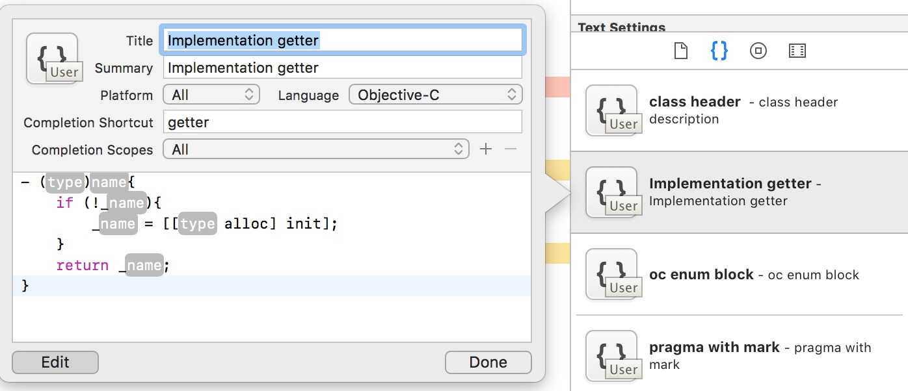
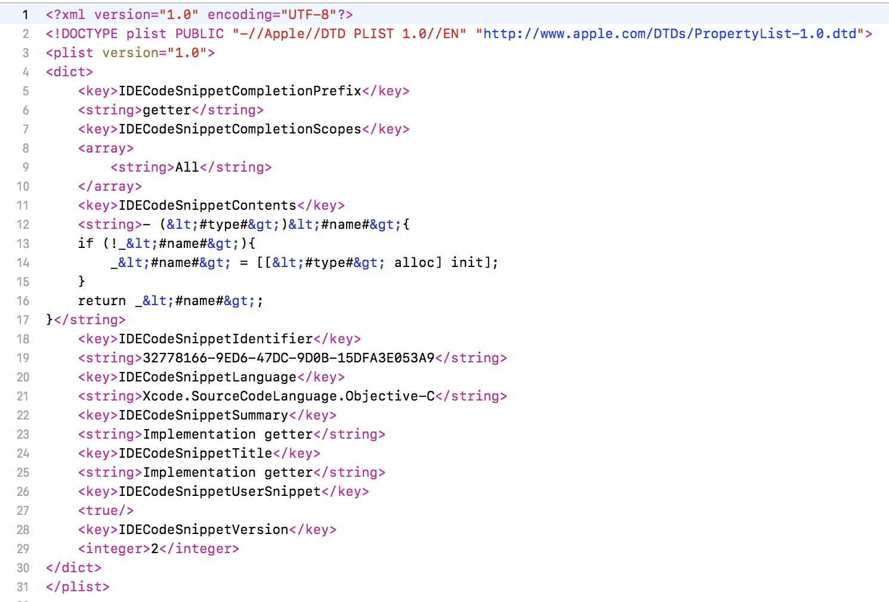

## CodeSnippets简介
xcode4 引入了一个新的 feature: code snippets，在整个界面的右下角，可以通过快捷键：cmd + ctrl + opt + 2 调出来。code snippets 是一些代码的模版，对于一些常见的编程模式，xcode 都将这些代码抽象成模版放到 code snippet 中，使用的时候，只需要键入快捷键，就可以把模版的内容填到代码中。

例如，在引入 GCD(Grand Central Dispatch) 后，当我们需要一个延时的操作时，只需要在 xcode 中键入：dispatch
, 就可以看到 xcode 中弹出一个上下文菜单，第一项就是相应的代码片段。如下图所示：


## 定义自己的CodeSnippet
当你觉得某段代码很有用，可以当作模版的时候，将其整块选中，拖动到 xcode 右下角的 code snippets 区域中即可。Xcode 会自动帮你创建一个新的代码片段。你可以单击该代码片段，在弹出的界面中选择 edit，即可为此代码片段设置快捷键等信息。

如果有些地方你想让用户替换掉，可以用 `<#被替换的内容#>` 的格式。
这样在代码片段被使用后，焦点会自动移到该处，你只需要连贯的键入替换后的内容即可。如下图所示：



code snippet存放于目录 `~/Library/Developer/Xcode/UserData/CodeSnippets` 中。而且这些代码片段都被保存成了 `.codesnippet` 类型的文件，文件内容如下所示：




## [XcodeSnippet] (https://github.com/Xcode-Snippets/xcodesnippet)
原始的.codesnippet文件可读性可维护性不是太好，Mattt 大神开发了一款名为 [XcodeSnippet] 的工具，它为开发者提供了一种更加方便的解决方案：

> 开发者只需编写 `.m` 类型的文件，XcodeSnippet 工具会将 `.m` 文件自动转换为 `.codesnippet` 文件

### 安装XcodeSnippet 
Xcode Snippet 工具安装起来很简单，只需要在终端中输入：

```sh
$ gem install xcodesnippet
```

### 编写 `.m` 文件
Xcode Snippet 工具能够将 `.m` 文件转换成 `.codesnippet` 文件，但 `.m` 文件的编写需要遵守一定的规则，下面是一个简单的例子： 

```sh

---
title: "Hello, World!"
summary: "Prints 'Hello World'"
completion-scope: Function or Method
---

println("Hello, World!")

```

### 转换 `.m` 文件
在终端中输入下面的指令就可以将 `.m` 文件转换为 `.codesnippet` 文件：

```sh
$ xcodesnippet install path/to/source.m
```

## NBCodeSnippets使用

我们把常用的XcodeSnippet模板放在了根目录下的`XcodeSnippets`文件夹中，其中`doc_snippets`是一些常用的注释模板，`usefulcode_snippets`是一些常用的代码模板，如果你有一些其他的常用snippets，也可以加入进来。

同时我们提供了一个脚本来批量将`.m` 文件转换为 `.codesnippet` 文件。你只要到`XcodeSnippet`目录下执行如下终端命令。

```sh
$ sh setup_snippets.sh
```


